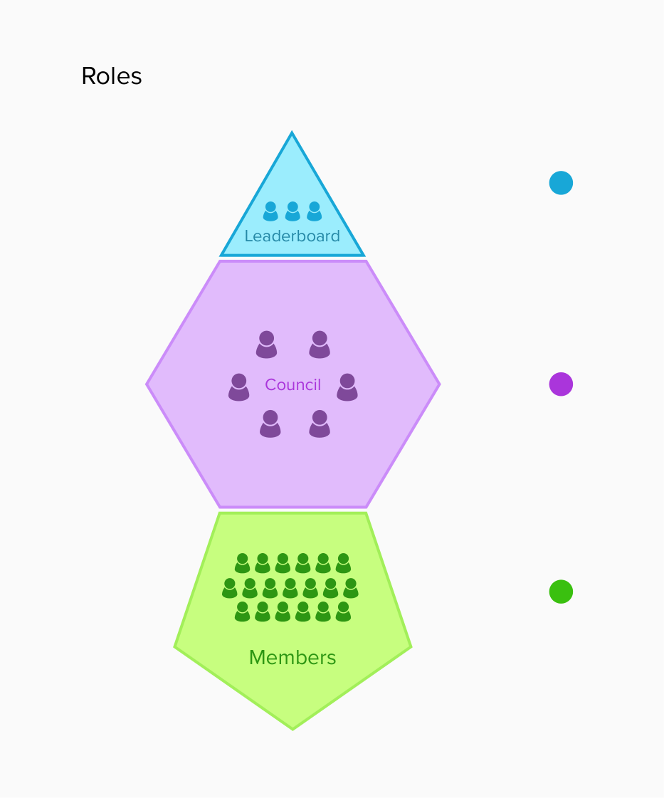
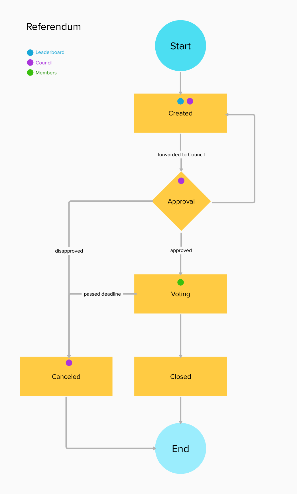
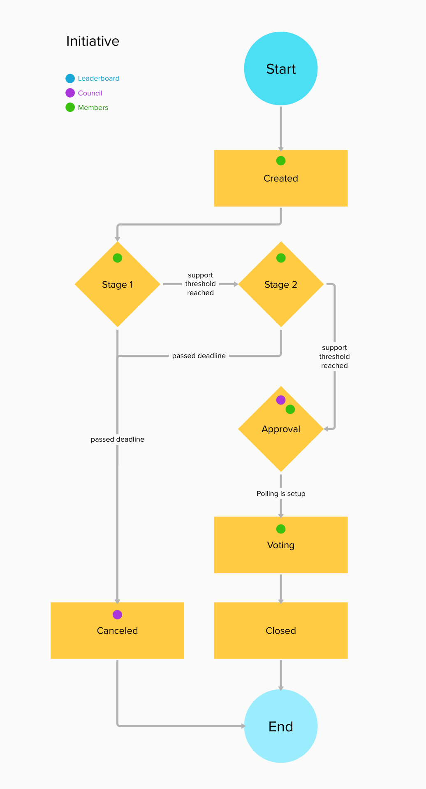
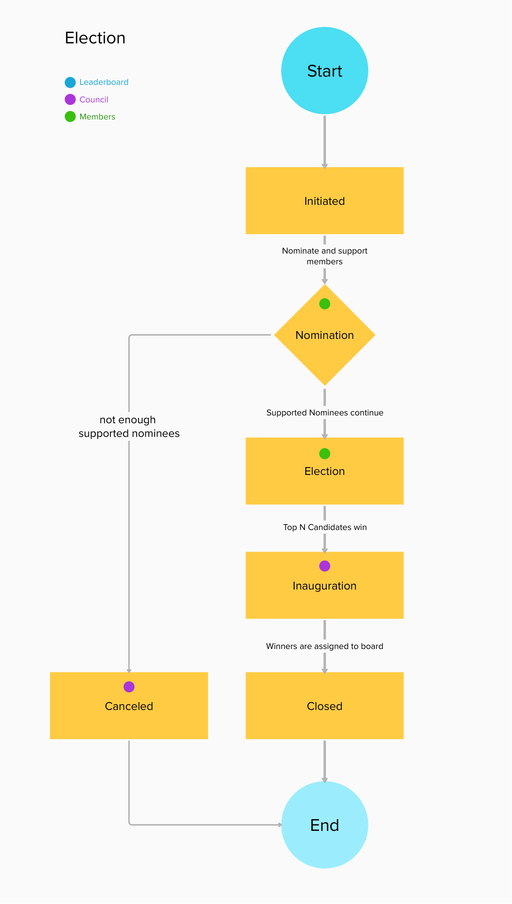

# OnDemo - A smart contract approach to a participatory political party platform

These smart contracts were developed as part of a master thesis at the Free University of Bolzano.
They show the feasability of an open-source blockchain-based approach to participatory platforms.

## Table of Contents

- [Background](#background)
- [Documentation](#documentation)
- [Development](#development)
- [Maintainers](#maintainers)
- [License](#license)
- [Security](#security)

## Background

More and more Political Parties are adopting internal voting and governance tools.
Due to their lack of transparency and centralized nature, most of tools and the integrated processes are suspect to possible manipulation.
As part of a master thesis this project explored the possibilities of smart contracts to host referendums, consolutations and elections 
in such a manner that processes are transparent and members need to adhere to the roles and rights involved.

This project may be extended to host more deliberative and participatory elements in the future.
It might as well be connected to a front-end application, which in turn should adhere to high security standards through end-to-end encryption and a mixnet 

Possible improvements to the backend include the encryption of voter-addresses and a mixnet-approach after receiving votes.

## Documentation

There is five main contracts involved in the project.

### 1. AccountManagement.sol
Takes care of creating and assigning roles to users. 
Different roles are needed to follow the processes of the other smart contracts.

The roles are:
Guest - A newly registered user
Member - A user which is allowed to participate on the platform as long as he's "active". Members are allowed to create referendums.
CouncilMember - A user which is part of the council. The council needs to approve different stages of the consoltation, referendum and election processes.
Leader - A user which is part of the leaderboard. Only Leaders are allowed to create referendums

  

### 2. Poll.sol

A poll is an interface for the 3 different polling options "Referendum", "Initiative" and "Election".
It holds answers and votercounts. It can manage exclusive as well as multi-voting.

### 3. Referendum.sol

A referendum can be started only by a user with the role "Leader".
It let's members choose from two answers, most likely Yes/No.

  

### 4. Initiative.sol

An initiative can be started by users with the role "Member", "CouncilMember", or "Leader"
It let's users create a general initiative with an unlimited amount of answers.
Initiatives need to pass 2 different stages which include deadlines and a minimal support threshold.
The council pushes the initiative through the different steps. This can be automated by an external service.

  

### 5. Election

An election can either elect the next leaderboard or the next council.
It can be started by the council only. This process should be changed to be triggered automatically after a deadline has passed.

  

## Development

OnDemo is still under development. Contributions are always welcome!

## Maintainers
The OnDemo project is currently maintained only by Sebastian Betz

## License
OnDemo is licensed under [GNU General Public License v3.0](LICENSE.txt).
